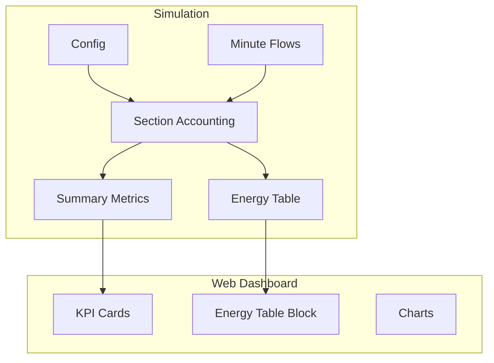

# BESS Model README Tasks Implementation Plan

## 1. Eliminate Identity 2 Failures and Provide Summary

### Root Cause Analysis

Identity 2 validates BESS state consistency by comparing two computations of closing state:

- **Formula A (bess_finish)**: `start - discharge - discharge_loss + charge - charge_loss`
- **Formula B (battery_closing)**: `opening - battery_draw_final + battery_store_final`

These are mathematically equivalent after capping logic, but the simulation uses **float32** for all arrays in `[bess_model/flows/section_outputs.py](bess_model/flows/section_outputs.py)`. With ~525K rows and values in the 10k–30k kW-min range, float32 has ~6–7 significant digits, so rounding differences of 0.001–0.01 kW are expected. The tolerance is `1e-3`, so many rows fail due to numerical precision alone.

### Implementation

| Action                   | Location                             | Details                                                                                                        |
| ------------------------ | ------------------------------------ | -------------------------------------------------------------------------------------------------------------- |
| Switch to float64        | `section_outputs.py` lines 217–258   | Change all `np.zeros(..., dtype=np.float32)` to `np.float64` in `_simulate_section_accounting`                 |
| Add identity_2_error     | `section_outputs.py`                 | Add `identity_2_error_kw_min` column = `bess_finish - battery_closing` for diagnostics                         |
| Add to summary metrics   | `pipeline.py`                        | Include `identity_2_max_error_kw_min` and optionally `identity_2_failure_reasons` (e.g., precision-only count) |
| Extend section 14 export | `section_outputs.py` OUTPUT_SECTIONS | Add `identity_2_error_kw_min` and `battery_closing_kw_min` to `14_identity_equation_2.csv` for debugging       |

### Failure Summary Report

After fixes, add a diagnostic summary (e.g., in `load_metric_cards` or a new endpoint) that reports:

- Count of identity 2 failures (expected: 0 after float64)
- If any remain: distribution of error magnitude, timestamps of worst rows
- Root causes: precision (float32), C-rate rounding, loss-table interpolation

---

## 2. Energy Table (Static Stock Elements)

### Definition

The Excel green section maps to annual energy flows (kWh):

**SOURCES**

| Element        | Source Column           | Formula                         |
| -------------- | ----------------------- | ------------------------------- |
| Solar Power    | `solar_kw`              | `sum(solar_kw)/60`              |
| Wind Power     | `wind_kw`               | `sum(wind_kw)/60`               |
| Draw from BESS | `battery_draw_final_kw` | `sum(battery_draw_final_kw)/60` |
| Draw from GRID | `grid_buy_kw`           | `sum(grid_buy_kw)/60`           |

**USES**

| Element      | Source Column            | Formula                          |
| ------------ | ------------------------ | -------------------------------- |
| Charge BESS  | `battery_store_final_kw` | `sum(battery_store_final_kw)/60` |
| Sell to GRID | `grid_sell_kw`           | `sum(grid_sell_kw)/60`           |
| Output (O/p) | `total_consumption_kw`   | `sum(total_consumption_kw)/60`   |

**LOSS**

| Element        | Source Column           | Formula                         |
| -------------- | ----------------------- | ------------------------------- |
| Discharge Loss | `battery_draw_loss_kw`  | `sum(battery_draw_loss_kw)/60`  |
| Charge Loss    | `battery_store_loss_kw` | `sum(battery_store_loss_kw)/60` |

### Implementation

| Action                 | Location         | Details                                                                                         |
| ---------------------- | ---------------- | ----------------------------------------------------------------------------------------------- |
| Compute energy table   | `services.py`    | New `compute_energy_table(summary_row, minute_flows)` or derive from parquet/summary            |
| Energy table dataclass | `services.py`    | `EnergyTableRow(name, value_kwh, category)` with categories: SOURCES, USES, LOSS                |
| Persist with summary   | `pipeline.py`    | Write `{plant}_energy_table.csv` alongside `{plant}_summary.csv` when simulation runs           |
| Dashboard UI           | `dashboard.html` | New tab or collapsible section "Energy Table" that displays SOURCES/USES/LOSS in a table layout |
| Config-driven          | Implicit         | Table is derived from simulation output; re-run with new config updates it                      |

The table is static for a given run and only changes when config or inputs change.

---

## 3. Expand KPI Cards and Green Section

### Current State

`[load_metric_cards](bess_model/web/services.py)` (lines 345–382) returns 3 cards: Net Grid Impact, Total Cycles, Capacity Health.

### Required Expansion

Show all plant summary columns and the identity/energy breakdown:

| Metric                       | Source  | Display                 |
| ---------------------------- | ------- | ----------------------- |
| rows                         | summary | Rows                    |
| grid_import_energy_kwh       | summary | Grid Import (kWh)       |
| grid_export_energy_kwh       | summary | Grid Export (kWh)       |
| final_degraded_capacity_kwh  | summary | Degraded Capacity (kWh) |
| final_soc_pct                | summary | Final SOC (%)           |
| cumulative_drawn_energy_kwh  | summary | Cumulative Drawn (kWh)  |
| cumulative_stored_energy_kwh | summary | Cumulative Stored (kWh) |
| cumulative_charge_count      | summary | Charge Count (cycles)   |
| identity_1_failures          | summary | Identity 1 Failures     |
| identity_2_failures          | summary | Identity 2 Failures     |
| max_identity_error_kw        | summary | Max Identity Error (kW) |

Plus the green section content: SOURCES, USES, LOSS as a structured block (Energy Table, as in section 2).

### Implementation

| Action                     | Location         | Details                                                                |
| -------------------------- | ---------------- | ---------------------------------------------------------------------- |
| Expand `load_metric_cards` | `services.py`    | Add MetricCard for each summary column; pass full summary row          |
| Add Energy Table block     | `dashboard.html` | Section below or beside metric cards showing SOURCES/USES/LOSS table   |
| Layout                     | `app.css`        | Ensure metric grid supports more cards (e.g., responsive grid, scroll) |

---

## 4. Factors Leading to Grid Import Minimization (Documentation)

Add an "Insights" or "Factors" section (in UI or docs) describing:

- **Battery capacity** — Larger capacity stores more surplus and reduces deficit reliance on grid
- **Battery power (C-rate)** — Higher power allows faster charge/discharge and better peak shaving
- **Generation–load match** — Solar/wind timing aligned with consumption reduces deficit minutes
- **Initial SOC** — Higher starting SOC provides more discharge headroom in early hours
- **Degradation and loss tables** — Lower losses and degradation preserve usable energy
- **Output profile** — Lower base load reduces deficit magnitude

Suggested location: `docs/simulation.md` and/or a collapsible "Factors" section in the dashboard.

---

## 5. Optimal Battery Utilization (Documentation)

Add brief documentation on:

- **Definition** — Balance between cycle utilization (energy throughput) and cycle life (degradation)
- **Trade-off** — More cycling reduces grid import but accelerates capacity loss
- **Indicators** — `cumulative_charge_count`, `final_degraded_capacity_kwh`, SOH %
- **Practical guidance** — Sizing for 90% profile coverage vs. 100%, replacement at ~70% SOH (per README notes)

Suggested location: `docs/simulation.md` and/or tooltip/help in the dashboard near battery-related KPIs.

---

## Data Flow Overview

---

## Files to Modify

| File                                                                                 | Changes                                                                         |
| ------------------------------------------------------------------------------------ | ------------------------------------------------------------------------------- |
| `[bess_model/flows/section_outputs.py](bess_model/flows/section_outputs.py)`         | float64, identity_2_error, extend section 14                                    |
| `[bess_model/core/pipeline.py](bess_model/core/pipeline.py)`                         | Add energy table computation, write `_energy_table.csv`, extend summary metrics |
| `[bess_model/web/services.py](bess_model/web/services.py)`                           | Expand `load_metric_cards`, add `load_energy_table`                             |
| `[bess_model/web/templates/dashboard.html](bess_model/web/templates/dashboard.html)` | Energy table section, expanded metric grid                                      |
| `[bess_model/web/static/app.css](bess_model/web/static/app.css)`                     | Layout for more KPI cards and energy table                                      |
| `[docs/simulation.md](docs/simulation.md)`                                           | Sections for grid import factors and optimal battery utilization                |

---

## Suggested Implementation Order

1. Fix identity 2 (float64 + diagnostics) and verify failures drop to 0
2. Add energy table computation and persistence
3. Expand KPI cards and add Energy Table block to dashboard
4. Add documentation for factors and optimal utilization

